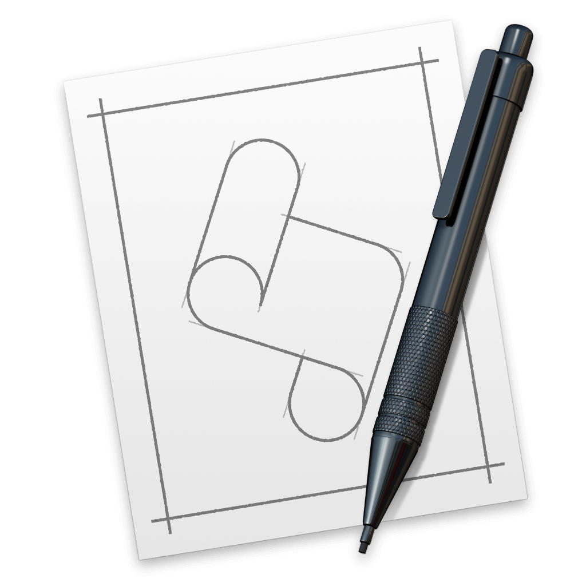

# AppleScript

過去に作成した作業効率化（自動処理）のAppleScriptを公開します。

* **テキスト形式（.applescript）** と **スクリプト形式（.scpt）** のセットにしています [（セットで公開する理由を参照）](#target1)。
* 動作チェックはスクリプト形式（.scpt）で行なっています。
* リポジトリ単位で管理し、ここでリスト化しています。
  

---
### List of script repositories

* [clipboard_to_plaintext](../../clipboard_to_plaintext/) -- クリップボードのデータをプレーンテキストへ変換
  

---

### セットで公開する理由

1. スクリプトエディタ.app（2.9）を使用しているが、コードに日本語が混ざると「UTF-8のテキスト形式」へ保存できない。
2. 「UTF-8のテキスト形式」じゃないとdiffができないので、GitHubへpushする前にコンバートしないといけない。
3. コンバートしたものは動作チェックしたくない。もし動作しない場合のためにスクリプト形式を添付する。

**【メモ】スクリプトエディタ.appの問題点**

- スクリプトエディタで新規作成しテキスト形式へ保存すると...
    - 日本語が混ざらない場合、**ASCII** ？ になる。
    - 日本語が混ざる場合、**Shift-JIS** になる。
    - Shift-JISで保存できない日本語が混ざる場合、**UTF-16** になる。
    - ちなみに、一度 **Shift-JIS** や **UTF-16** で作成したファイル中の日本語を取り除いて、上書き保存しても文字コードは変わらない。
